<div align="center">

[English](README.md) · 简体中文

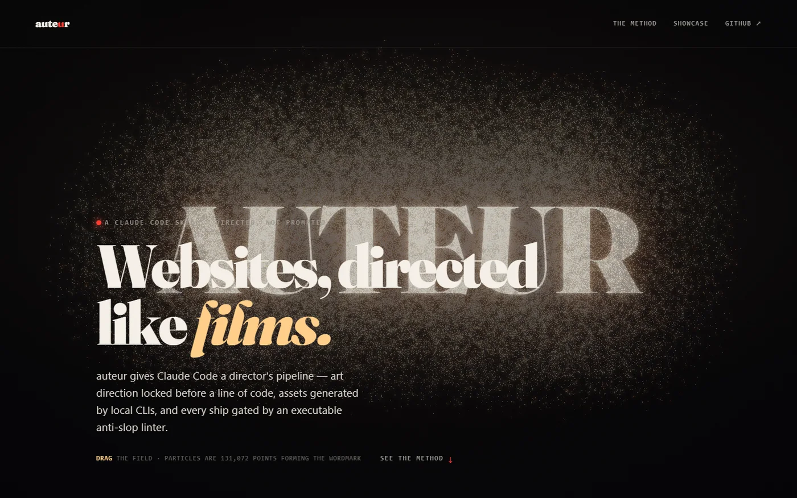

# auteur

### 像执导电影一样构建网站的 Claude Code skill。

[](https://github.com/agiwhitelist/auteur/stargazers)
[](https://github.com/agiwhitelist/auteur/releases)
[](https://github.com/agiwhitelist/auteur/actions/workflows/ci.yml)
[](LICENSE)
[](https://agiwhitelist.github.io/auteur/)

**写代码前先锁定视觉方向。素材由本地 CLI 生成。每次发布都必须通过可执行的 anti-slop linter 和真实的动效检查。**

[**▶ 打开在线画廊**](https://agiwhitelist.github.io/auteur/) &nbsp;·&nbsp; [安装](#install-30-seconds) &nbsp;·&nbsp; [工作原理](#how-it-works) &nbsp;·&nbsp; [质量门禁](#the-gates-this-is-the-point)

<br>


<sub>这不是效果图——这是真实的落地页。131,072 个 GPU 粒子维持着 logo 形态，随鼠标拖拽撕裂并重组。由它所推销的 skill 亲自构建。</sub>

</div>

---

## 安装（30 秒）

auteur 是一个 [Agent Skill](https://code.claude.com/docs/en/skills)：包含一个 `SKILL.md`、
参考配方（recipes）和几个可运行脚本。约 1MB，无依赖，无
API key，无需构建步骤。

**支持任意 agent —— 一条命令搞定。** 自动检测已安装环境并写入对应
agent 的 skills 目录：

```bash
npx skills add agiwhitelist/auteur
```

<sub>Claude Code · Codex · Cursor · OpenCode · Gemini CLI · Windsurf · Cline ·
Goose · Copilot · Hermes · Kiro · Roo · OpenHands — [75+ agents](https://www.skills.sh/)，
项目级安装或加 `-g` 全局安装。</sub>

**作为 Claude Code 插件** —— 原地安装与更新：

```
/plugin marketplace add agiwhitelist/auteur
/plugin install auteur@auteur
```

**OpenClaw：**

```bash
openclaw skills install git:agiwhitelist/auteur --global
```

**其他任何支持读取 `SKILL.md` 的工具** —— 直接 clone 到 agent 的 skills
目录：

```bash
git clone --depth 1 https://github.com/agiwhitelist/auteur ~/.claude/skills/auteur
```

然后只需提问：

```
"build me a cinematic landing with auteur"
```

Claude 会运行整个流水线 —— commit-sheet → 素材 → 构建 → 门禁 —— 然后把网站交给你。

## 实力证明：十个在线网站

别只听宣传——直接打开看。每个网站均由 auteur 构建，且全部以 **0 fails / 0 warns** 的成绩
通过该 skill 自带的 linter 检查。第十个不是 Claude 做的：把 `SKILL.md` 和一份制表匠的
需求交给 Kimi K3，它没看过前面九个网站，最终交出的却是一个明亮、衬线体、以墨绿为主的页面
——而这个品类的所有本能反应都是黑配金。动工之前，它先用文字写明了自己打算打破的四条
「本能习惯」。真正可迁移的是这套纪律，不是某个模型。

<table>
<tr>
<td width="33%" align="center">
  <a href="https://agiwhitelist.github.io/auteur/showcase/flux/">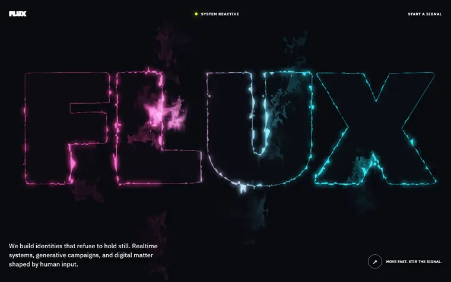</a>
  <br><b>FLUX</b><br><sub>WebGL 流体在鼠标下撕裂霓虹 logo</sub>
</td>
<td width="33%" align="center">
  <a href="https://agiwhitelist.github.io/auteur/showcase/swarm/">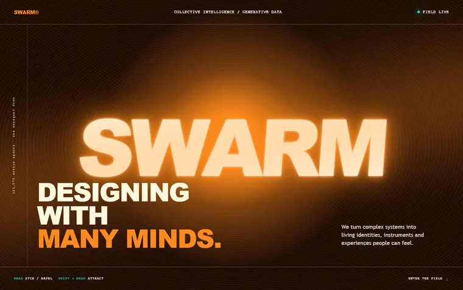</a>
  <br><b>SWARM</b><br><sub>131,072 个 GPU 粒子在 curl-noise 场中运动</sub>
</td>
<td width="33%" align="center">
  <a href="https://agiwhitelist.github.io/auteur/showcase/static/">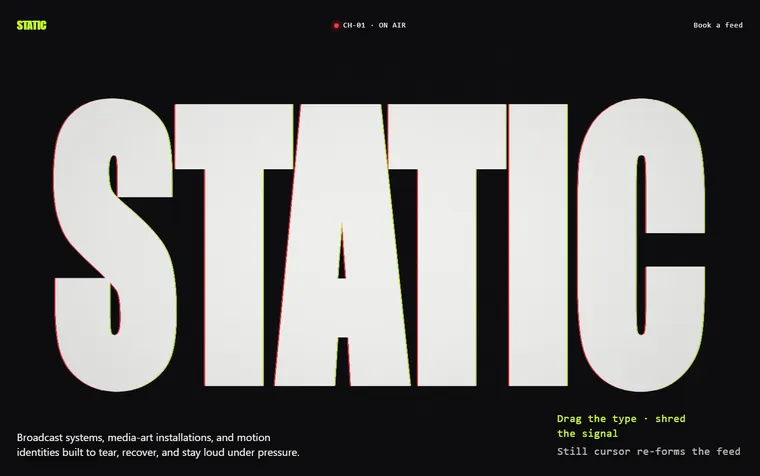</a>
  <br><b>STATIC</b><br><sub>拖拽即可撕裂的广播故障风大字体</sub>
</td>
</tr>
<tr>
<td align="center">
  <a href="https://agiwhitelist.github.io/auteur/showcase/hale/">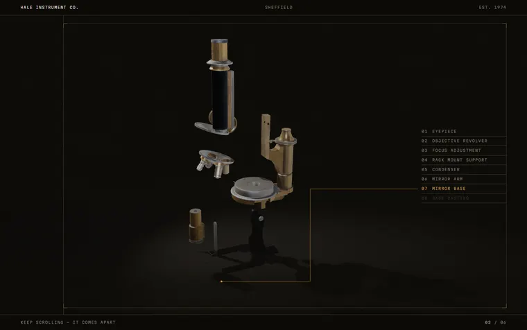</a>
  <br><b>HALE</b><br><sub>滚动时拆解的 CC0 显微镜—— sourced，非生成</sub>
</td>
<td align="center">
  <a href="https://agiwhitelist.github.io/auteur/showcase/noon/">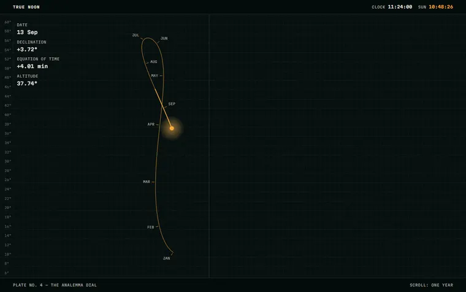</a>
  <br><b>TRUE NOON</b><br><sub>根据当前纬度实时计算的一年真实太阳位置</sub>
</td>
<td align="center">
  <a href="https://agiwhitelist.github.io/auteur/showcase/proof/">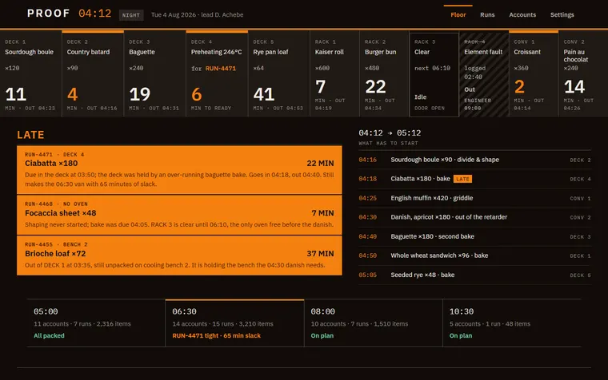</a>
  <br><b>PROOF</b><br><sub>五屏生产车间看板——这是一个产品，不是单页</sub>
</td>
</tr>
<tr>
<td align="center">
  <a href="https://agiwhitelist.github.io/auteur/showcase/drift/">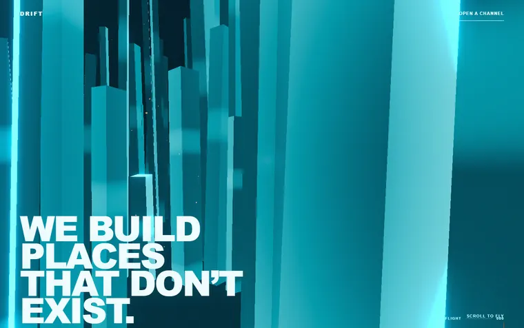</a>
  <br><b>DRIFT</b><br><sub>穿梭于体积雾与淡青色巨石之间的 3D 世界</sub>
</td>
<td align="center">
  <a href="https://agiwhitelist.github.io/auteur/showcase/atlas/">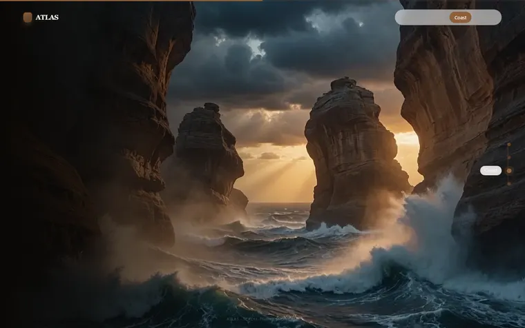</a>
  <br><b>ATLAS</b><br><sub>照片级真实飞行：沙丘 → 峡谷 → 海岸 → 山顶</sub>
</td>
<td align="center">
  <a href="https://agiwhitelist.github.io/auteur/showcase/abyss/">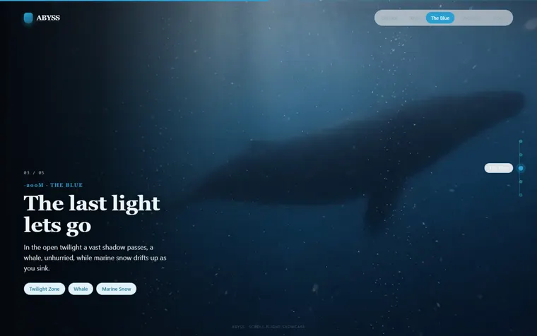</a>
  <br><b>ABYSS</b><br><sub>深海下潜，带镜头推轨的滚动 scrub 视频</sub>
</td>
</tr>
<tr>
<td align="center" colspan="3">
  <a href="https://agiwhitelist.github.io/auteur/showcase/horo/">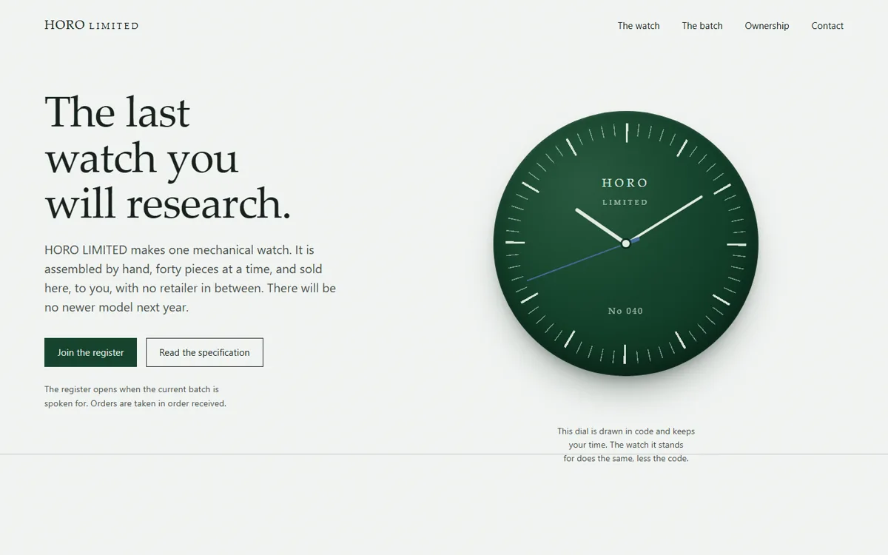</a>
  <br><b>HORO</b><br><sub>由 Kimi K3 构建，而非 Claude——表盘用纯 CSS 绘制，且走的是你的真实时间</sub>
</td>
</tr>
</table>

FLUX / STATIC / SWARM / DRIFT 是实时 WebGL。HALE 采用 CC0 HDRI 环境光下的 CC0 几何模型。
TRUE NOON 仅 145KB，零光栅素材。PROOF 是系统级应用——包含五个路由，受设计系统漂移门禁保护。
ATLAS 和 ABYSS 属于视频 scrub 级别（`reference/scroll-flight.md`）。HORO 是这套纪律的
可迁移性验证：换一个模型、同一份文件，要过的门禁一模一样——slopscan 0/0/0、DPR 2 下
53fps、最差文字对比度 6.50，页面实测亮度（0.740）与它自己在动工前写进 commit-sheet 的
承诺（0.72）吻合。落地页是第十一个作品，由它所倡导的同一套纪律构建。

> 本仓库中**没有任何 benchmark 数据**。auteur 是一种设计纪律，而不是一个追求吞吐量指标的系统。
> 唯一的量化声明——linter 结果——你可以通过一条命令自行复现（见下文）。

> 它同样**不是组件库**。没有任何东西来自现成的 registry：上面每一个网站都从自己的
> commit-sheet 起手写成，原生实现，零运行时依赖。如果你想要拿来即用的动效组件，
> 请用 shadcn 或 originkit.dev——这个 skill 执导页面，而不是囤积零件。

## 工作原理

导演级流水线，严格按顺序执行：

1. **侦察（Recon）。** `refscout` 分析获奖在线网站——它们实际加载的库、
   固定的场景数、滚动预算、实际渲染的字体和调色板——`moodboard` 则从 Bing
   / Pinterest / are.na 抓取带编号的 contact sheet。视觉方向基于真实素材和
   对同类作品现状的时效性解读来决定，绝不凭空想象。
2. **Commit-sheet。** 确立唯一的视觉方向——单一品牌色、字体系统、动效预算、
   明确的反面参考（anti-references）——在写*任何* markup 之前全部落笔。
   杜绝“先看看效果再说”的随意漂移。
3. **生成素材。** 图像、视频帧、深度图和 3D 几何体由本地 CLI 生成
   （Codex / Gemini 图像生成、Blender headless、Depth-Anything），
   根据成本和各工具的实际专长进行路由。
4. **构建。** 单一 WebGL context，GSAP/Lenis 滚动，DOM 动效仅限 transform 和
   opacity——源自经过验证的配方：流体、GPGPU 粒子、3D 世界、
   滚动形变状态机。
5. **门禁。** 未通过以下两道门禁前，禁止发布。

### 质量门禁（核心所在）

**`slopscan`** —— 一个零依赖 linter，针对具体的“劣质代码（slop）”*阻断构建*，
而非凭感觉：

```bash
git clone --depth 1 -b gh-pages https://github.com/agiwhitelist/auteur site
node scripts/slopscan.mjs site                  # the landing
node scripts/slopscan.mjs site/showcase/flux    # any showcase
# → Summary: 0 fails, 0 warns, 0 suppressed
```

它能抓出 250–290° 的紫蓝 AI 渐变、`transition: all`、
用 `addEventListener('scroll')` 做动画、自动播放音频、无 poster 的视频、
缺少 `prefers-reduced-motion` 分支的 WebGL、默认的 Inter/Space-Grotesk 字体、
滥用破折号的文案等。它在 CI 中对每个发布页面运行——确保上文的
“0 slop” 声明不会悄悄腐化。

**`motionqa`** —— 一个 Playwright 测试流程，在受限 CPU 下驱动页面，
遇到掉帧、长任务、自动播放声音或 console 报错即判定失败。网站
目标是 60fps；门禁负责强制执行。它在 **DPR 2** 下测量（1440×900 @2x =
520 万像素）：全屏后期效果（bloom、景深、颗粒）的开销按像素计价，DPR 1
的测量结果会给「在任何 Retina 笔记本上都会卡顿的页面」发一张 60fps 的合格证。
在没有全屏效果的场景里，两种测量结果一致——这正是重点：等哪天加上 bloom，
这个数字依然诚实。它同时会标记出开发服务器，因为那上面的数字描述的是一个
没人会真正加载的构建。

```bash
node scripts/motionqa.mjs site/showcase/swarm --headed
```

**`systemscan`** —— 针对多屏产品：爬取每个路由，读取浏览器实际渲染的内容，
如果某类组件偏离了其声明的同类预算，或任何组件缺少可见的 focus 状态，即判定失败。

### 侦察与素材获取（阶段 0 和 1）

```bash
node scripts/refscout.mjs --from awwwards --limit 8
# → design/refs/REFERENCES.md + shots/ — stack, pinned scenes, scroll budget,
#   fonts and painted palette per site

node scripts/moodboard.mjs "editorial brutalist dark" "hard rim light macro" --limit 24
# → design/moodboard/contact-sheet.png — 20 numbered tiles, indexed to source

node scripts/source.mjs hdri  "coastal dusk cold clear" --res 2k   # Poly Haven, CC0
node scripts/source.mjs model "chair wood" --res 1k                # glTF + textures
```

无需 API key，无需登录。如果网站对 headless 浏览器隐藏了 CSS，
报告会显示 **NO CAPTURE** 而不是靠猜，因此报告绝不会凭空捏造没见过的字体。
每个获取文件的许可证都记录在 `assets/sourced/ASSETS-SOURCED.md` 中，
CC-BY 图像会带上署名信息，确保发布时不会漏掉归属。允许将素材视频用作环境层，
但拒绝用作 hero 区域：如果惊艳时刻（wow moment）靠的是素材库，那就谈不上惊艳。

## 仓库内容

```
SKILL.md              Claude Code 加载的 skill
reference/*.md        配方：recon, build, direct, system, scroll-cinema,
                      scroll-flight, motion, assets, taste, verify
scripts/refscout.mjs  参考侦察 + 网站指纹识别
scripts/moodboard.mjs 图像搜索 -> 带编号的 contact sheet
scripts/source.mjs    版权干净的素材获取 + 许可台账
scripts/systemscan.mjs 跨路由设计系统漂移门禁
scripts/slopscan.mjs  anti-slop linter（零依赖）
scripts/motionqa.mjs  Playwright 动效 + a11y 门禁
scripts/shoot.mjs     响应式截图捕获
scripts/chromadiff.mjs 色彩与亮度漂移门禁，以 OKLCH 计量
templates/            commit-sheet, storyboard, cinema-QA, system-sheet
                      + scroll-flight-engine.js — 即插即用的滚动 scrub 视频引擎
```

十个展示网站和落地页位于 [`gh-pages`](https://github.com/agiwhitelist/auteur/tree/gh-pages)
分支，这也是 GitHub Pages 部署的分支——因此安装该 skill 只会拉取约 1MB
的配方，而不是 45MB 的渲染视频。CI 会同时 checkout 两个分支，
并用 `main` 分支的 linter 检查 `gh-pages` 上的网站，确保门禁依然
覆盖所有已发布的页面。

## 环境要求

- **Claude Code**（skill 在其内部运行）。
- **Node 18+** 用于 `slopscan`（零依赖）。
- **Playwright** 用于 `motionqa` / `shoot` / `refscout` / `moodboard`
  （`npx playwright install chromium`）。
- 可选，用于素材生成：你本地安装的任何媒体 CLI
  （Codex、Gemini/`agy`、Blender）。skill 会自动路由到可用工具，
  并在工具缺失时优雅降级为手动编写的素材。

## 无障碍底线

auteur 发布的每个网站：`prefers-reduced-motion` → 呈现丰富的静态画面，绝不白屏；
关闭 JavaScript 后所有文案依然可读；无全屏闪烁；在
390 / 768 / 1440 宽度下响应式适配且无水平溢出。这些是强制执行的底线，而非愿景。

## 致谢

照片级滚动 scrub 视频引擎（`templates/scroll-flight-engine.js`）
及其技术改编自 cyw 的 **[scroll-world](https://github.com/cth9191/scroll-world)**
（MIT 协议）——一个专注于 AI 视频镜头飞行的同源 Claude Code skill。
auteur 将其与自身的素材生成及 slopscan / motionqa 门禁结合使用。

## 许可证

MIT © agiwhitelist — 详见 [LICENSE](LICENSE)。Vendor 进来的组件保留其
原有的 MIT 声明（见文件头）。
